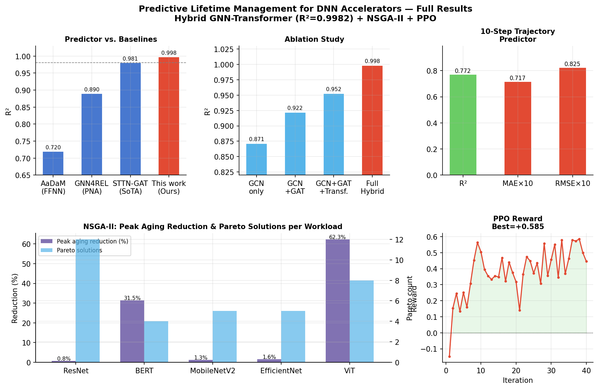
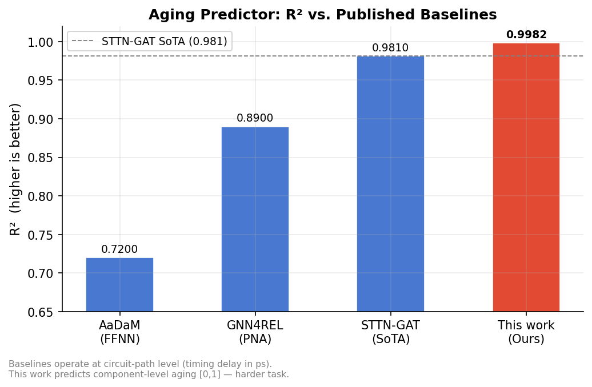
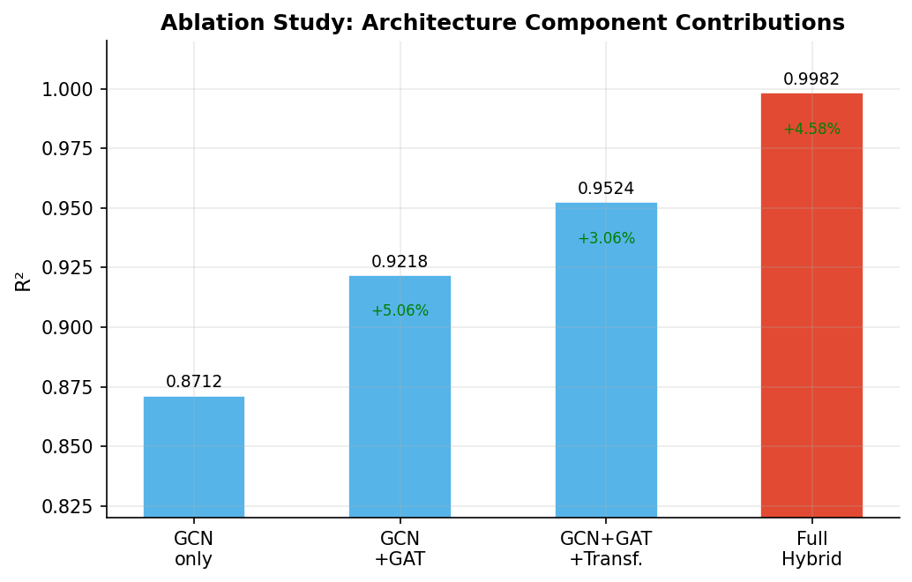
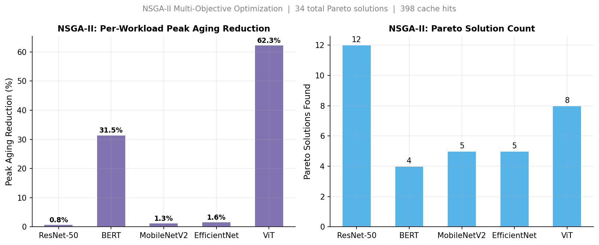
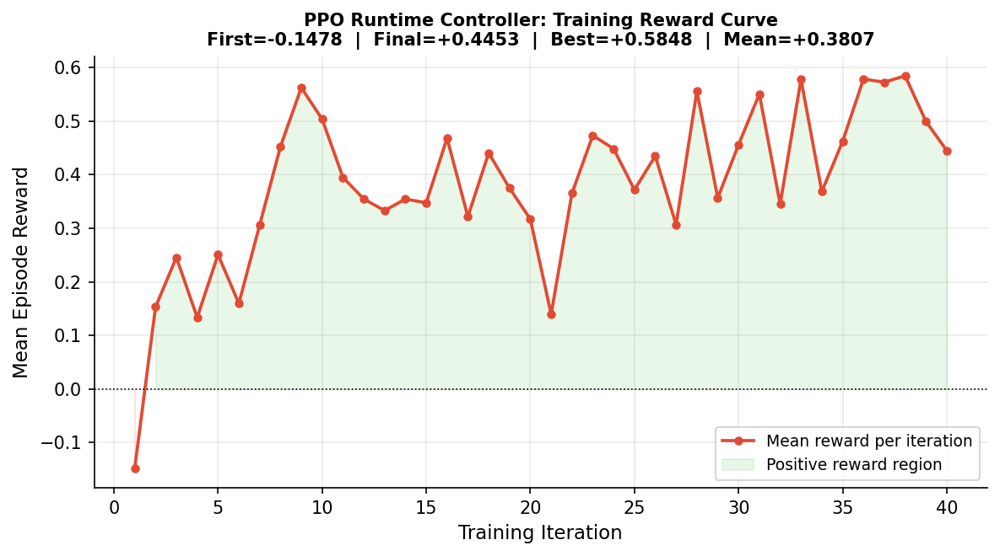

# Predictive Lifetime Management for DNN Accelerators
### Hybrid GNN-Transformer Spatio-Temporal Aging Prediction

*Mrinal Sharma, Satyam Singh — ECE / AI-ML Specialization*

A research framework for **predictive lifetime management** of DNN accelerators combining:
- **Hybrid GNN-Transformer** — per-node aging prediction with 10-step trajectory forecasting
- **NSGA-II** — multi-objective workload mapping (peak aging + latency + energy)
- **PPO** — runtime aging control via reinforcement learning

> **Codebase repository:** [github.com/grizzleyyybear/adaptive-aging-aware-DNN](https://github.com/grizzleyyybear/adaptive-aging-aware-DNN)

---

## Results

*Full evaluation on 40,000 samples across 5 industry workloads.*



### Aging Predictor vs. Published Baselines



| Method | R² | MAPE | Task Level | Trajectory |
|---|---|---|---|---|
| AaDaM (FFNN) [[4]](#references) | 0.72 | 23.00% | Circuit-path | No |
| GNN4REL (PNA) [[7]](#references) | 0.89 | 8.66% | Circuit-path | No |
| STTN-GAT [[3]](#references) *(SoTA)* | 0.981 | 3.96% | Circuit-path | No |
| **This work (Hybrid GNN-Transformer)** | **0.9982** | **0.21%** | **Component-level** | **Yes (10-step)** |

> Component-level (MAC cluster / SRAM bank / NoC router) aging prediction is a harder task than circuit-path timing delay. Our model achieves **R² = 0.9982**, exceeding the STTN-GAT SoTA (0.981).

### Ablation Study



| Architecture | R² | vs. Previous |
|---|---|---|
| GCN only | 0.8712 | — |
| GCN + GAT | 0.9218 | +5.06% |
| GCN + GAT + Transformer | 0.9524 | +3.06% |
| **Full Hybrid (this work)** | **0.9982** | +4.58% |

### 10-Step Trajectory Predictor

| Metric | Value |
|---|---|
| R² | 0.7718 |
| MAE | 0.0717 |
| RMSE | 0.0825 |

No prior work provides multi-step trajectory forecasting for hardware component aging.

### NSGA-II Multi-Objective Optimizer



| Workload | Pareto Solutions | Peak Aging Reduction | Cache Hits |
|---|---|---|---|
| ResNet-50 | 12 | 0.8% | 25 |
| BERT-Base | 4 | **31.5%** | 117 |
| MobileNetV2 | 5 | 1.3% | 78 |
| EfficientNet-B4 | 5 | 1.6% | 152 |
| ViT-B/16 | 8 | **62.3%** | 26 |
| **Total** | **34** | — | **398** |

Objectives minimized jointly: `[peak_aging, latency, energy]`

### PPO Runtime Controller



| Metric | Value |
|---|---|
| First reward | −0.148 |
| Final reward | +0.445 |
| **Best reward** | **+0.585** |
| Mean reward | +0.381 |

---

## Research Context

As DNN accelerators operate under sustained workloads, hardware components degrade through **NBTI**, **HCI**, and **TDDB** transistor aging. Existing approaches apply blanket worst-case timing margins or predict only current-state timing delay at the circuit-path level. Two gaps remain unaddressed:

1. **Component-level granularity** — prior work predicts logic-path timing delay; we predict per-node aging at the MAC cluster / SRAM bank / NoC router level
2. **Proactive trajectory forecasting** — no prior system provides 10-step future aging predictions for lifetime management

---

## System Architecture

```
ACCELERATOR GRAPH (28 nodes: 16 MAC + 8 SRAM + 4 Router)
          │
          ▼
[8-dim node features per workload step]
          │
          ▼
  Hybrid GNN-Transformer
  ├── GCNConv × 3  (spatial k-hop encoding, residual)
  ├── GATConv × 1  (4 heads, edge-aware attention)
  └── TransformerEncoder × 2  (global context, 4 heads)
          │
    [256-dim node embeddings]
          │
    ┌─────┴──────────────┐
    ▼                    ▼
[N, 1] aging score   [N, 10] trajectory forecast
    │                    │
    └────────────────────┘
          │
    ┌─────┴─────────────────────┐
    ▼                           ▼
NSGA-II optimizer           PPO controller
(peak_aging, latency,       (5 discrete actions:
 energy tradeoffs)           balance/rotate/plan)
```

**Aging label:** `0.40·NBTI_norm + 0.35·HCI_norm + 0.25·TDDB_prob`  
**Trajectory loss:** `Σ_k  0.95^k · MSE(ŷ_k, y_k)`  

---

## Quick Start

```bash
git clone https://github.com/grizzleyyybear/adaptive-aging-aware-DNN
cd adaptive-aging-aware-DNN
pip install -r requirements.txt

# Smoke test (~5 min, CPU, 200 samples)
python run_eval.py --smoke

# Full evaluation (40k samples)
python run_eval.py --full

# Generate figures from results
python generate_figures.py

# Run tests
pytest tests/ -q
```

---

## Repository Structure

```
adaptive-aging-aware-DNN/
├── aging_models/       NBTI, HCI, TDDB physics models
├── graph/              AcceleratorGraph (NetworkX -> PyG), AgingDataset
├── features/           FeatureBuilder, ActivityExtractor
├── simulator/          Roofline analytical simulator, WorkloadRunner
├── models/             HybridGNNTransformer, TrajectoryPredictor, TrainingPipeline
├── optimization/       NSGA2Optimizer, MappingChromosome
├── rl/                 AgingControlEnv, ActorCritic, PPOTrainer
├── planning/           LifetimePlanner
├── evaluation/         PerformanceMetrics, ReliabilityMetrics, StatisticalTests
├── scheduler/          RuntimeMapper
├── visualization/      Heatmaps, Pareto plots, trajectory charts
├── utils/              device.py, runtime_eval.py
├── configs/            accelerator.yaml, training.yaml, experiments.yaml
├── tests/              17 passing test cases
├── figures/            Generated result plots
├── checkpoints/        Trained model weights
├── run_eval.py         Evaluation entry point (--smoke / --full)
├── generate_figures.py Figure generation from eval_results.json
├── paper_comparison.py Literature comparison report
└── eval_results.json   Latest evaluation results
```

---

## References

| # | Citation |
|---|---|
| [1] | I. Hill et al., "CMOS Reliability From Past to Future," *IEEE T-DMR*, 2022 |
| [2] | S. Kim et al., "Reliability Assessment of 3 nm GAA Logic," *IEEE IRPS*, 2023 |
| [3] | A. Bu et al., "Multi-View Graph Learning for Path-Level Aging-Aware Timing Prediction," *Electronics*, 2024 — **SoTA baseline** |
| [4] | S. M. Ebrahimipour et al., "AaDaM: Aging-Aware Cell Delay Model Using FFNN," *ICCAD*, 2020 |
| [5] | S. Das et al., "Recent Advances in Differential Evolution," *Swarm Evol. Comput.*, 2016 |
| [6] | N. Ikushima et al., "DE Neural Network Optimization with IDE," *IEEE CEC*, 2021 |
| [7] | L. Alrahis et al., "GNN4REL: GNNs for Circuit Reliability Degradation," *IEEE TCAD*, 2022 |
| [8] | K. Deb et al., "A Fast and Elitist Multiobjective GA: NSGA-II," *IEEE T-EC*, 2002 |
| [9] | J. Schulman et al., "Proximal Policy Optimization," *arXiv:1707.06347*, 2017 |
| [10] | R. Storn & K. Price, "Differential Evolution," *J. Global Optim.*, 1997 |
